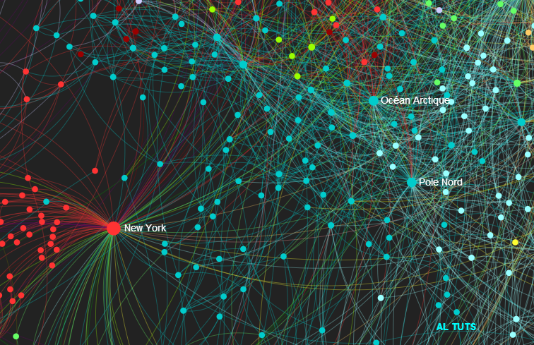

# DataVisio: Javascript Graph Visualizer

## Overview
Viewing database relations (*at the time*) is tricky due to multiple, overlapping dependencies that can often be bidirectional, unidirectional, or even conditional. The idea is to have a simple tool capable of viewing this in a visual, easy-to-understand format.
 
This was done with [Sigma.JS](https://github.com/jacomyal/sigma.js/), a Javascript package developed by Jacomyal that uses HTML to display .JSON file details via Javascript commands.
 
This design is heavily inspired by NoSQL applications such as Neo4J, and Gephi.
  
<b>Figure 1: </b> Arctic.JSON view  
## Extra
Due to the original codebase being severely deprecated (*years ago*), the current github version is using the Gephi plugin equivalent